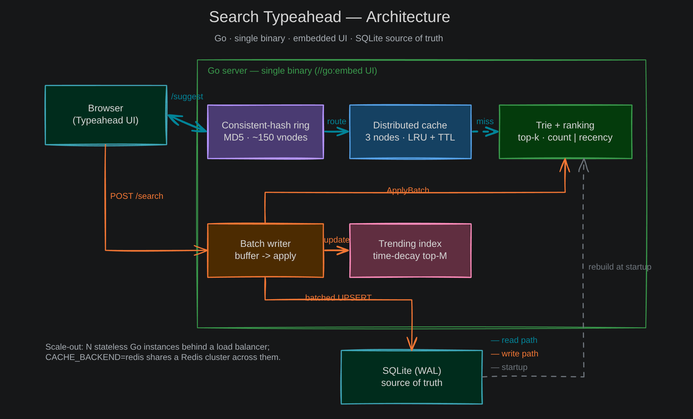

# Search Typeahead System

A search autocomplete system (Go backend + embedded HTML/JS UI) built for the
HLD assignment.



API documentation: [`api.md`](api.md). Performance report (measured): [`performance-report.md`](performance-report.md).

## Quick start

Requires Go 1.22+ (developed on 1.26).

```bash
cd backend
go mod tidy                 # fetch the one dependency (pure-Go SQLite)
make seed                   # generate a 150k-query dataset → SQLite  (or `make load` for the committed 100k sample)
make run                    # build the Trie and serve on :8080
# open http://localhost:8080
```

Or without make:

```bash
cd backend
go run ./cmd/load   -data data/queries.csv -db data/typeahead.db
go run ./cmd/server -db data/typeahead.db
```

Try it:

```bash
curl 'http://localhost:8080/suggest?q=ip'      # → up to 10 suggestions, count-desc
curl -X POST localhost:8080/search -d '{"q":"iphone"}'   # → {"message":"Searched"}
```

## Datasets

The committed `data/queries.csv` is a 100,000-query synthetic sample
(`cmd/gen`), so the repo meets the spec's ≥100k minimum out of the box.
`make seed` regenerates it at 150k; `make load` reloads whatever is committed.

For a real open-source dataset (English Wikipedia pageviews → top 150k by views):

```bash
cd backend
./scripts/fetch_dataset.sh 20240101-120000 data/wiki_full.csv
sort -t, -k2,2 -nr data/wiki_full.csv | head -150000 > data/queries.csv
make clean load run
```

## Distributed cache (Redis mode)

By default the cache runs as in-process logical nodes. To run the nodes as real
Redis servers — same ring, same routing, only the node backend changes:

```bash
docker compose up -d                         # 3 Redis nodes on :6379–:6381
cd backend && ./bin/server -db data/typeahead.db -cache-backend redis
docker compose down
```

## Status

Functionally complete across all three rubric blocks: basic implementation (60),
trending/recency (20), and batch writes (20). Distributed cache + consistent
hashing, recency ranking + `/trending`, and async batch writes are implemented,
unit-tested (`go test ./...`), and benchmarked on a real 117k-query Wikipedia
dataset — see [`performance-report.md`](performance-report.md)
(~30k req/s, 94–99% cache hit-rate, 40×+ write reduction, ~25% rebalance vs ~75%
for `hash % N`).

## Layout

`backend/cmd/` entrypoints, `backend/internal/` one package per component,
`backend/web/` the embedded UI; `api.md`, `performance-report.md` and
`architecture-diagram.png` at the repo root, with UI captures in `screenshots/`.
